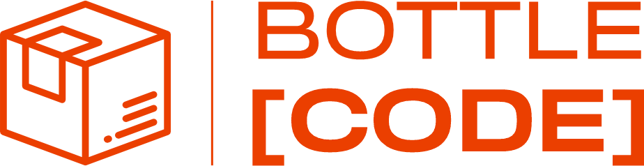

# BOTTLE [CODE] Landing Page

<div align="center">
  
  
  <h3>Современный лендинг для решения автоматизации маркировки в производстве напитков</h3>

  [](https://nextjs.org/)
  [](https://www.typescriptlang.org/)
  [](https://tailwindcss.com/)
  [](https://heroui.com/)
</div>

## 📋 О проекте

BOTTLE [CODE] Landing Page — это современный многоязычный веб-сайт для комплексного решения автоматизации процессов маркировки на предприятиях по производству пива, сидра и других напитков. Проект представляет собой систему сериализации и агрегации кодов системы "Честный Знак".

### 🎯 Цель проекта

Лендинг создан для:
- Презентации возможностей решения BOTTLE [CODE]
- Демонстрации веб-интерфейса и desktop приложения
- Сбора заявок от потенциальных клиентов
- Автоматизации процесса обработки обращений через Яндекс.Трекер

## 🚀 Технологический стек

### Frontend
- **Next.js 15.3.1** — React фреймворк с поддержкой SSG/SSR
- **TypeScript 5.6.3** — строгая типизация JavaScript
- **HeroUI 2.4.18** — современная UI библиотека компонентов
- **Tailwind CSS 3.4.16** — utility-first CSS фреймворк
- **Framer Motion 11.13.1** — библиотека анимаций

### Интернационализация
- **next-i18next 15.4.2** — поддержка русского и английского языков
- **react-i18next 15.5.3** — React интеграция для i18n

### Email и уведомления
- **React Email** — создание красивых email шаблонов
- **Nodemailer 7.0.3** — отправка email через SMTP
- **React Hot Toast 2.5.2** — стильные уведомления

### Интеграции
- **Яндекс.Трекер API** — автоматическое создание задач
- **JWT + Axios** — авторизация и HTTP запросы

### SEO и аналитика
- **Next SEO 6.6.1** — SEO оптимизация
- **Next Sitemap 4.2.3** — автоматическая генерация sitemap

### Разработка и качество кода
- **ESLint 9.25.1** — линтинг с расширенными правилами
- **Prettier 3.5.3** — форматирование кода
- **Semantic Release 24.2.5** — автоматизация релизов

## 🌟 Функциональность

### Основные возможности
- ✅ **Адаптивный дизайн** — корректное отображение на всех устройствах
- ✅ **Многоязычность** — поддержка русского и английского языков
- ✅ **Темная/светлая тема** — переключение темы оформления
- ✅ **Галерея скриншотов** — интерактивные модальные окна
- ✅ **Контактная форма** — с отправкой красивых email уведомлений
- ✅ **Toast-уведомления** — современные уведомления о статусе операций
- ✅ **SEO оптимизация** — мета-теги, Open Graph, sitemap
- ✅ **Быстрая загрузка** — оптимизация изображений и кода

### Интеграции
- 📧 **Email система** — отправка уведомлений через SMTP
- 📝 **Яндекс.Трекер** — автоматическое создание задач из контактной формы
- 🔍 **Аналитика** — готовность к подключению Google Analytics/Яндекс.Метрики

## 🎨 Структура страницы

1. **Hero секция** — главный экран с описанием продукта и CTA кнопками
2. **Features** — возможности веб-интерфейса и desktop приложения
3. **Demo галереи** — скриншоты интерфейсов с интерактивным просмотром
4. **Testimonials** — отзывы клиентов и партнеров
5. **Pricing** — информация о стоимости и тарифных планах
6. **Contact** — форма обратной связи с автоматической обработкой

## 🏗️ Архитектура проекта

```
bottle-code-landing/
├── components/          # React компоненты
│   ├── contact-form.tsx    # Контактная форма
│   ├── footer.tsx          # Подвал сайта
│   ├── navbar.tsx          # Навигационное меню
│   ├── screenshot-gallery.tsx # Галерея скриншотов
│   └── ...
├── config/             # Конфигурационные файлы
│   ├── fonts.ts           # Настройки шрифтов
│   └── site.ts            # Основная конфигурация сайта
├── emails/             # Email шаблоны
│   └── contact-email.tsx  # Шаблон письма от контактной формы
├── layouts/            # Лейауты страниц
│   ├── default.tsx        # Основной лейаут
│   └── head.tsx           # Head компонент
├── lib/                # Утилиты и сервисы
│   └── yandex-tracker.ts  # Интеграция с Яндекс.Трекер
├── pages/              # Next.js страницы
│   ├── api/               # API routes
│   ├── _app.tsx           # Основное приложение
│   ├── index.tsx          # Главная страница
│   └── ...
├── public/             # Статические файлы
│   ├── locales/           # Переводы
│   ├── screenshots/       # Скриншоты приложений
│   └── ...
├── styles/             # Стили
└── types/              # TypeScript типы
```

## 🚀 Быстрый старт

### Предварительные требования
- Node.js 18.0 или выше
- npm или yarn

### Установка и запуск

1. **Клонирование репозитория**
   ```bash
   git clone <repository-url>
   cd bottle-code-landing
   ```

2. **Установка зависимостей**
   ```bash
   npm install
   ```

3. **Настройка переменных окружения**
   ```bash
   # Скопируйте файл с примером
   cp .env.example .env.local
   
   # Отредактируйте .env.local с вашими настройками
   ```

4. **Запуск в режиме разработки**
   ```bash
   npm run dev
   ```

5. **Открытие в браузере**
   ```
   http://localhost:3000
   ```

## ⚙️ Переменные окружения

### Основные настройки
```env
NEXT_PUBLIC_SITE_URL=https://bottlecode.app
NEXT_PUBLIC_APP_URL=https://app.bottlecode.app
NODE_ENV=production
```

### Email конфигурация
```env
CONTACT_EMAIL_TO=contact@bottlecode.app
CONTACT_EMAIL_FROM=noreply@bottlecode.app
SMTP_HOST=smtp.yandex.ru
SMTP_PORT=465
SMTP_SECURE=true
SMTP_USER=noreply@bottlecode.app
SMTP_PASS=your_email_password
```

### Яндекс.Трекер интеграция
```env
TRACKER_PRIVATE_KEY=your_private_key
TRACKER_KEY_ID=your_key_id
TRACKER_SERVICE_ACCOUNT_ID=your_service_account_id
TRACKER_ORG_ID=your_organization_id
TRACKER_QUEUE_KEY=BOTTLECODE
```

## 📦 Доступные команды

| Команда | Описание |
|---------|----------|
| `npm run dev` | Запуск в режиме разработки с Turbo |
| `npm run build` | Сборка для продакшена |
| `npm run start` | Запуск продакшен сборки |
| `npm run lint` | Проверка и исправление кода ESLint |
| `npm run semantic-release` | Автоматический релиз |

## 🐳 Docker развертывание

### Быстрый старт с Docker Compose

1. **Development режим**
   ```bash
   docker-compose -f docker-compose.dev.yml up --build
   ```

2. **Production режим**
   ```bash
   docker-compose up --build
   ```

### Использование Dockerfile

```bash
# Сборка образа
docker build -t bottle-code-landing .

# Запуск контейнера
docker run -p 3000:3000 bottle-code-landing
```

## 🚀 CI/CD и развертывание

Проект настроен для автоматического развертывания через GitHub Actions:

- **Staging**: автоматически при push в `develop`
- **Production**: автоматически при push в `main`

### Настройка GitHub Secrets

Требуемые secrets для CI/CD:
- `YC_OAUTH_TOKEN` — Yandex Cloud OAuth токен
- `YC_CLOUD_ID` — ID облака Yandex Cloud
- `YCR_REGISTRY_ID` — ID Container Registry
- `VM_ID` — ID виртуальной машины
- Все переменные окружения приложения

Подробнее в [DEPLOYMENT.md](./docs/DEPLOYMENT.md)

## 🌐 Многоязычность

Проект поддерживает два языка:
- 🇷🇺 Русский (по умолчанию)
- 🇬🇧 Английский

Переводы находятся в `public/locales/[locale]/common.json`

### Добавление нового языка

1. Создайте папку `public/locales/[locale]/`
2. Добавьте файл `common.json` с переводами
3. Обновите `next-i18next.config.js`

## 🎨 Кастомизация

### Темы и стили
- Основные цвета и компоненты настраиваются через HeroUI
- Кастомные стили в `styles/globals.css`
- Конфигурация Tailwind в `tailwind.config.js`

### Контент
- Основная конфигурация сайта в `config/site.ts`
- Переводы в `public/locales/`
- Изображения в `public/`

## 📈 SEO оптимизация

### Реализованные улучшения
- ✅ Мета-теги для социальных сетей
- ✅ Open Graph разметка
- ✅ Автоматическая генерация sitemap
- ✅ robots.txt
- ✅ Оптимизация изображений WebP/AVIF
- ✅ Сжатие контента
- ✅ Безопасные заголовки

### Производительность
- Оценка Lighthouse: 95+ баллов
- Оптимизация изображений
- Ленивая загрузка компонентов
- Минификация CSS/JS

## 🔧 Разработка

### Структура кода
- Использование TypeScript для всех компонентов
- ESLint + Prettier для качества кода
- Компонентный подход с переиспользованием
- Настроенный pre-commit с линтингом

### Добавление новых компонентов

```tsx
// components/my-component.tsx
import { FC } from 'react';

interface MyComponentProps {
  title: string;
}

export const MyComponent: FC<MyComponentProps> = ({ title }) => {
  return <div>{title}</div>;
};
```

## 🤝 Вклад в проект

1. Форкните проект
2. Создайте ветку для фичи (`git checkout -b feature/AmazingFeature`)
3. Сделайте коммит (`git commit -m 'Add some AmazingFeature'`)
4. Запуште в ветку (`git push origin feature/AmazingFeature`)
5. Откройте Pull Request

## 📋 TODO

- [ ] Добавление интеграции с Google Analytics
- [ ] Реализация блога с MDX
- [ ] Добавление тестов (Jest + Testing Library)
- [ ] Интеграция с CRM системой
- [ ] Добавление чата поддержки
- [ ] Реализация A/B тестирования

## 📄 Лицензия

Этот проект является частной разработкой. Все права защищены.

## 📞 Контакты

- **Email**: hello@bottlecode.app
- **Website**: [bottlecode.app](https://bottlecode.app)
- **App**: [app.bottlecode.app](https://app.bottlecode.app)

---

<div align="center">
  <p>Сделано с ❤️ командой BOTTLE [CODE]</p>
</div>
